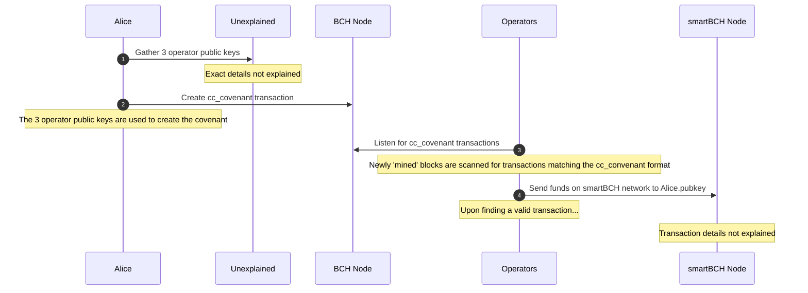
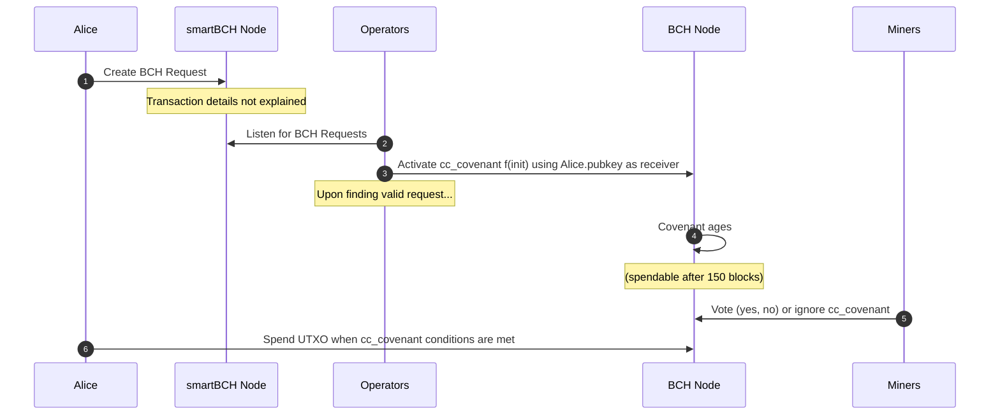

# SHA-Gate

~Placeholder description of document~

## Actors

The following are actors who must be involved in any SHA-Gate style transaction between BCH and smartBCH.

* Alice - An example person transacting via SHA-Gate.
* Operators (1...3) - Facilitate receiving and dispersing funds on both networks.
* BCH-Node - The communication endpoint for the BCH main chain.
* smartBCH-Node - The communication endpoint for the smartBCH side chain.
* BCH miners - Individuals who compete to validate new blocks on the BCH main chain.
* Unexplained - A placeholder entity for mechanisms not explained in the SHA-Gate document.

## BCH to smartBCH Sequence Diagram

This diagram shows Alice initiating the sequence necessary to move BCH from the BCH main chain onto the smartBCH side chain.

## smartBCH to BCH Sequence Diagram

This diagram shows Alice initiating the sequence necessary to move BCH from the smartBCH side chain onto the BCH main chain.

## Unknowns

This is a list of things not evidently clear in the SHA-Gate article.

### BCH to smartBCH

* How does Alice acquire the 3 public keys of the Operators?
* How do operators scan BCH transactions for cc_covenants when P2SH outputs would change depending on various factors? (e.g. which operator public keys are used)
* How are Operators able to unlock funds on the smartBCH network?

### smartBCH to BCH

* What does a 'BCH request' transaction on smartBCH look like? Code example?
